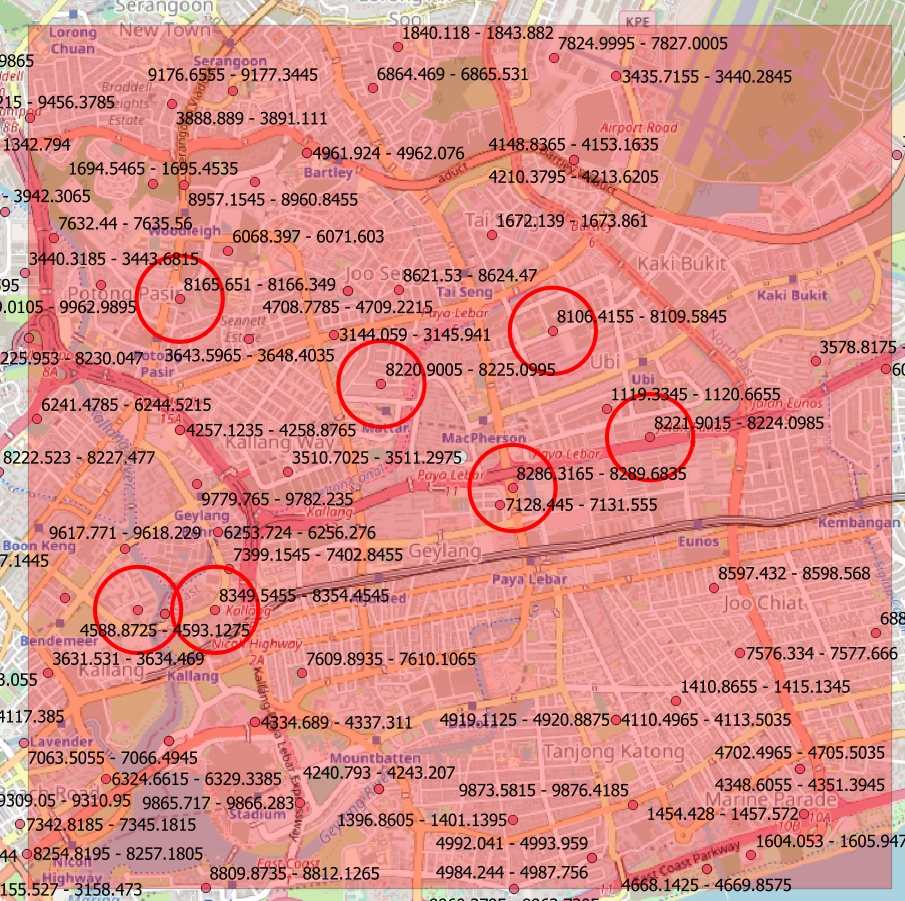

.. FrequencyOverlaps documentation master file, created by
   sphinx-quickstart on Sun Feb 12 17:11:03 2012.
   You can adapt this file completely to your liking, but it should at least
   contain the root `toctree` directive.

Welcome to FrequencyOverlaps!
============================================

The goal of this plugin is to assist Spectrum Managers in searching for frequency resources especially when more and more services are put into use.  This plugin helps Spectrum Managers to search for overlapping frequencies as each service normally encompass a frequency with an associated bandwidth or a start and stop frequency for it to effectively operate.  It becomes difficult to visualise if frequency overlaps occurs when there are more and more services utilising similar frequency bands, and to ensure that these services are separated geographically far enough on the map.

The user must first load information about existing location of services into a layer on QGIS.  This can be imported from `Spreadsheet Layers <https://github.com/camptocamp/QGIS-SpreadSheetLayers>`_ , CSV, Esri Shapefiles, Mapinfo or any other formats supported by QGIS. The information within the file must contain at least information of the frequency resources utilised for the service either information about the center frequency and bandwidth or a start and stop frequency entered in separate columns.  The frequency and bandwidth may be in the range of Hz, kHz, MHz or GHz, and the layer should be a point or polygon layer in QGIS.  The frequencies or bandwidth should be numerical fields; that **SHOULD NOT** include the suffix of Hz, kHz, MHz or GHz behind the frequency or bandwidth number such as 1234 MHz.

Difference Between Frequency and Bandwidth
==========================================
.. index:: Difference Between Frequency and Bandwidth

Bandwidth and frequency are the terms commonly used in communications and networking.  The bandwidth affects the size of the information that can be transferred while the frequency is the carrier for the information to be transferred on.  More information can be read from `Difference Between Frequency and Bandwidth <https://circuitglobe.com/difference-between-frequency-and-bandwidth.html#:~:text=The%20frequency%20of%20a%20signal%20defines%20the%20total%20number%20of,is%20specified%20as%20cycles%2Fsecond.>`_ .

Frequency Overlaps Overview
===========================
.. index:: Functions of Frequency Overlaps

.. image:: images/FrequencyOverlaps.png

1) Select the QGIS layer from the drop down list which contains information about the location where the frequency is used.
2) Select the mode where the data is entered in the layer.  This can be either Center Frequency & Bandwidth or Start & Stop Frequency.
3) Select the field that contains the Center Frequency, if the Center Frequency mode is selected.
4) Select the units that this field is entered in.  Can be Hz, kHz, MHz or GHz.
5) Select the field that contains the Bandwidth, if the Center Frequency mode is selected.
6) Select the units that this field is entered in.  Can be Hz, kHz, MHz or GHz.
7) Limit the range to be displayed post analysis.  A 0 value will display maximum range.

There are 5 Search modes to check for frequency overlaps:
"""""""""""""""""""""""""""""""""""""""""""""""""""""""""
* Search within the layer
* Search within a range
* Search against another layer
* Search for frequency
* Search for frequency gaps

Search within the layer
-----------------------
.. index:: Search within the layer

This option searches for frequency overlaps between each feature in the layer.  The output may be overwhelming with a lot of frequency overlaps between each features.  Use the **Ignore Distance greater than** to limit overlaps that are within a distance away.

The output may show a single circle only, such as the figure shown below.  This represents there is a frequency overlaps within frequencies on the same location.
It may be noticed that the frequency of 1 channel is 8202.705 - 8203.295 MHz and the other channel is 8203.295 - 8204.217 MHz.  In a normal situation it seems like there is no overlaps.  The contention comes at the middle frequency 8203.295 MHz since it both belongs to the lower frequency channel and higher frequency channel and the algorithm treats such instance as an overlap.

.. image:: images/On-site_Overlaps.png

The output may also shows 2 circles with a dashed line linking them.  This represents frequency overlaps between the frequency of the 2 locations.  Open the attribute tables of "Overlap Locations" and "Overlap Joins" to get more information on which frequencies are overlapping.

.. image:: images/AlternateSite_Overlaps.png

Search within a range
-----------------------
.. index:: Search within the layer

This option is similar to the option Search within the layer.  The only difference in this option is that the search is within the frequency of interest only.

Search against another layer
----------------------------
.. index:: Search against another layer

This option allows searching for frequency overlaps from another layer against the frequencies recorded in this main layer.  This option is used in for example a neighbor may wish to add a list of sites with multiple frequencies.   It may not be effective to search for the frequencies one at a time.  This option will search all frequencies from the alternate layer against all the records in the main layer and flag out if there are any frequency overlaps with the main layer.  Again the **Ignore Distance greater than** may be used to limit the display to only show frequency overlaps within a certain distance.

Search for frequency
----------------------------
.. index:: Search for frequency

As the name implies, this option searches and highlight all areas that contains a frequency of interest of the user.  The **Ignore Distance greater than** is disabled as this option only highights locations that overlaps the range entered by the user.

Search for frequency gaps
-------------------------
.. index:: Search for frequency gaps

This option searches for frequency that is not being utilised within a range of search.  User has to set a search range in the **Ignore Distance greater than** else the maximum search range of 1000 Km will be used as the range to search for any available frequency gaps within the range; which in a sense may not be effective in terms of frequency reuse.  The user shall set the frequency range of interest to evaluate for frequency gaps and **Left-click** on a location on the map.  A area will be drawn symbolising the searched range.  Circled areas symbolises areas where frequencies overlaps with the search range.  Open the attribute table of "Overlap Gaps" to check for frequencies that are available within the search area.  Similar to the contention problem the "Overlap Gaps" may show a frequency for example 8202.705 - 8203.295 MHz is available, however the "Overlap Locations" layer may flag there is overlap with frequency 8203.295 - 8204.217 MHz which is being assigned.  The reason for this is while 8202.705 to 8203.295 MHz is seened as unused and available, the 8203.295 - 8204.217 MHz on the other hand had been assigned.  The view will be from which side the 8203.295 MHz should belong to, whether it belongs to the unused range or to the assigned range.  The algorithm will still flag this as an overlap if the start/stop frequency of an unused range frequency is exactly the same as the stop/start of an assigned frequency range.  The user may continuosly clicked around the map for analysis.  At any point **Right-click** to cancel the operation.  An example of the Search for frequency gaps in 8000 - 8500 MHz is shown below, the circle symbolises the locations where this frequency is involved.

Contents:

.. toctree::
   :maxdepth: 2

Indices and tables
==================

* :ref:`genindex`
* :ref:`modindex`
* :ref:`search`

