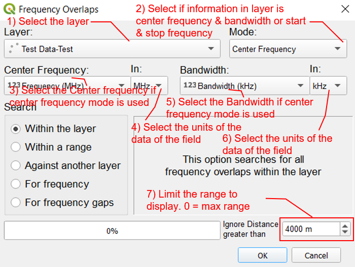

.. FrequencyOverlaps documentation master file, created by
   sphinx-quickstart on Sun Feb 12 17:11:03 2012.
   You can adapt this file completely to your liking, but it should at least
   contain the root `toctree` directive.

Welcome to FrequencyOverlaps!
============================================

The goal of this plugin is to assist Spectrum Managers in searching for frequency resources especially when more and more services are put into use.  This plugin helps Spectrum Managers to search for overlapping frequencies as each service normally encompass a frequency with an associated bandwidth or a start and stop frequency for it to effectively operate.  It becomes difficult to visualise if frequency overlaps occurs when there are more and more services utilising similar frequency bands, and to ensure that these services are separated geographically far enough on the map.

The user must first load information about existing location of services into a layer on QGIS.  This can be imported from `Spreadsheet Layers <https://github.com/camptocamp/QGIS-SpreadSheetLayers>`_ , CSV, Esri Shapefiles, Mapinfo or any other formats supported by QGIS. The information within the file must contain at least information of the frequency resources utilised for the service either information about the center frequency and bandwidth or a start and stop frequency entered in separate columns.  The frequency and bandwidth may be in the range of Hz, kHz, MHz or GHz, and the layer should be a point or polygon layer in QGIS.  The frequencies or bandwidth should be numerical fields; that **SHOULD NOT** include the suffix of Hz, kHz, MHz or GHz behind the frequency or bandwidth number such as 1234 MHz.

Difference Between Frequency and Bandwidth
==========================================
.. index:: Difference Between Frequency and Bandwidth

Bandwidth and frequency are the terms commonly used in communications and networking.  The bandwidth affects the size of the information that can be transferred while the frequency is the carrier for the information to be transferred on.  More information can be read from `Difference Between Frequency and Bandwidth <https://circuitglobe.com/difference-between-frequency-and-bandwidth.html#:~:text=The%20frequency%20of%20a%20signal%20defines%20the%20total%20number%20of,is%20specified%20as%20cycles%2Fsecond.>`_ .

Functions of Frequency Overlaps
===============================
.. index:: Functions of Frequency Overlaps

1) Select the QGIS layer from the drop down list which contains information about the location where the frequency is used.
2) Select the mode where the data is entered in the layer.  This can be either Center Frequency & Bandwidth or Start & Stop Frequency.

Contents:

.. toctree::
   :maxdepth: 2

Indices and tables
==================

* :ref:`genindex`
* :ref:`modindex`
* :ref:`search`

